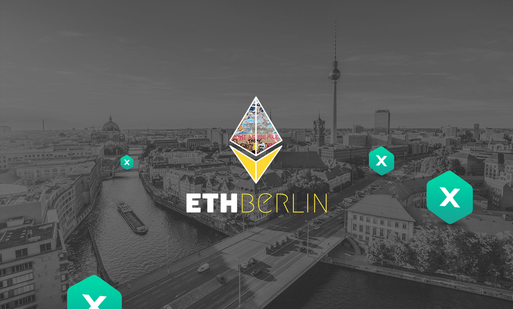
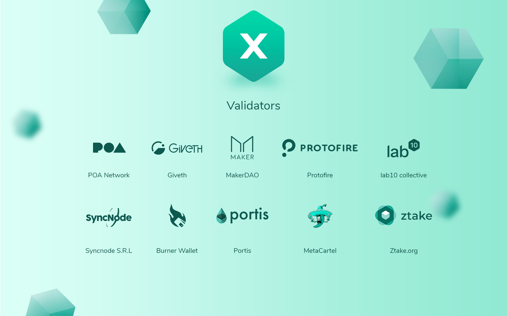
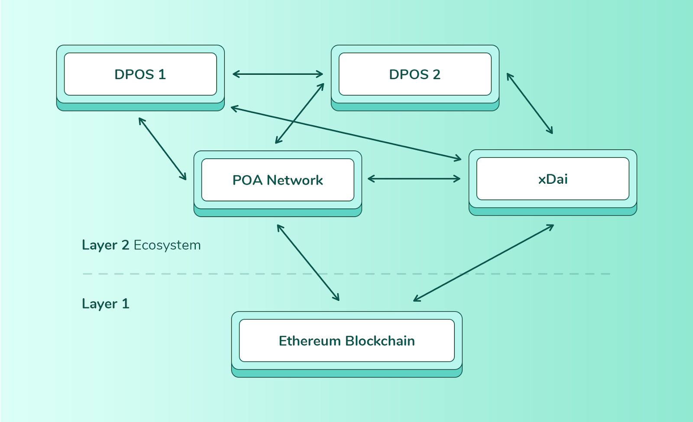

# xDai: The birth of the stable chain

The time: September 5th, 2018. The place: ETHBerlin 2018. Over kebabs and currywurst, a small group of project founders and tech leads were engaged in a spirited discussion regarding stable coins, specifically [Tether](https://tether.to/), [Haven](https://www.havenprotocol.com/) and Dai. Stablecoins were gaining massive popularity, but volatile gas prices and high transaction costs were undercutting some of their usefulness. As the beers continued to flow, POA’s tech lead Igor Barinov was struck with a thought - had a stable coin attempted to bridge directly to a sidechain?

Prior to this, POA Network had experience and success with using interoperability bridges, thanks to TokenBridge technology. So why not bridge a stable coin? Igor jotted down his idea on a napkin at the dinner table. Bridge an ERC20 stable coin to its own sidechain - the bridged version becomes the native coin of the new sidechain. This would create a stable native coin blockchain. And just like that, on the back of a napkin, the foundation of the xDai Stable Chain was born.

At POA Network, we are known for iterating and shipping fast. So with DevCon around the corner, a deadline was set to release v1 of the Stable Chain by the end of October 2018. After some deliberation, we chose Dai to be the stablecoin of choice for several reasons: Dai is algorithmically stable, there is an exciting roadmap with multi-collateral CDP \(Collateralized Debt Position\), and the Maker project has a friendly approach to new development. By the end of October 2018, the xDai Stable Chain was live and already integrated into [BlockScout](https://blockscout.com/poa/dai).

As xDai went live, some users questioned the need for a brand new chain. Why not just mint Dai on another network, like POA for example, they asked? The answer was related to ease of use.

We realized that by creating a new sidechain with xDai as its native coin, we implemented a one-token transactional model that was ideal for peer-to-peer payments. In order for users to pay merchants or one another with ERC20 Dai, they also needed ETH for gas. There were always two coins involved with every transaction. With xDai, you only needed xDai! This innovation also allowed for controlled gas prices, which are fixed \(enabling exact cost planning\) and extremely inexpensive.

However, creating a new sidechain also meant that the network started out centralized, with only one validator: POA Network. We were very aware of that fact, and within 2 weeks of release, we incorporated POA’s on-chain governance to welcome three more validators. Almost a year later that number has grown to 10 validators and counting. All xDai Stable Chain validators are respected and well known organizations within the greater community. They include:

* [POA Network](http://www.poa.network)
* [Giveth](https://giveth.io/)
* [MakerDAO](https://makerdao.com/)
* [Protofire](https://protofire.io)
* [Burner Wallet](https://xdai.io)
* [Portis](http://portis.io)
* [MetaCartel](https://metacartel.org)
* [Ztake.org](http://ztake.org)
* [Lab10](https://lab10.coop/)

#### xDai Stable Chain’s Killer App

For any chain to experience success, it requires a killer application. Austin Griffth’s [Burner Wallet](https://xdai.io/), a peer-to-peer payment wallet deployed on top of xDai, was the DApp that introduced the xDai Stable Chain to the wider community. The Burner Wallet was battle-tested for the first time in ETHDenver, where it was used by almost 3000 attendees over the entire weekend to pay for food and drink. The insanely cheap transactions on xDai were on display when the total transaction costs for [38,432.56 dollars spent on meals was $.0.20](https://medium.com/gitcoin/burner-wallet-at-ethdenver-was-faa3851ea833)!

[https://www.youtube.com/watch?v=neZeaXAnkAg](https://www.youtube.com/watch?v=neZeaXAnkAg)

Merchants were certainly impressed by the minimal transactions costs, and developers searching for an Ethereum scalability solution platform also took note. Soon after, xDai was used as a deployment platform for many of Consensys’s projects including [Helena Network](https://www.google.com/search?q=helena+xdai&oq=helena+xdai&aqs=chrome..69i57j33.1847j0j4&sourceid=chrome&ie=UTF-8) and [TruSet Data](http://truset.com).

xDai’s influence and momentum have continued to grow, and an endorsement by Ethereum co-founder and[ Consensys head Joseph Lubin](https://twitter.com/ethereumJoseph/status/1096580919312302081), cemented the chain as a difference maker within the ecosystem. In a short period of time, xDai has been adopted in all parts of the world, including a recent experiment by the Kenyan central bank.

#### The Decentralization of xDai

While xDai is currently in production, with 10 validators representing 10 diverse entities, it is still seen as a semi-centralized POA \(Proof of Autonomy\) based network. Given the right \(but unlikely\) circumstances, compromised parties can collude together to corrupt the network. The same criticism is being leveled at Facebook’s Libra project, a blockchain with a number of similarities to the xDai Stable Chain.

To address these concerns, and continue to advance the protocol, we are working to decentralize xDai by implementing a new consensus algorithm called POSDAO. [POSDAO](https://forum.poa.network/t/posdao-white-paper/2208) is a unique DPoS \(Delegated Proof-of-Stake\) consensus that differs from other DPoS based projects such as EOS. With POSDAO, validators are selected to serve the network for a period of time \(typically one week\) called a staking epoch. During that epoch, each validator pool \(consisting of validators and delegators\) in the protocol receives equal block and bridge rewards. When an epoch is complete, the rewards are split proportionally among validator pool members \(including delegators\), and a new set of validators is chosen based on staking ratios and a randomness beacon.

This allows for newly qualified validators to attract delegators and meet the selection criteria. Minimum stake amounts are reasonable, giving anyone the opportunity to participate in and benefit from the consensus process. This low barrier to entry vastly increases the level of decentralization in the protocol.

Along with the upgrade to the xDai Stable Chain, we are also introducing a new token called $DPOS. The $DPOS token will create new economic incentives and play a major role in another new concept called multi-chain staking. This unique form of staking involves using the same token \($DPOS\) to provide stake across multiple chains. With the proliferation of stable coins, the xDai concept can be mirrored to new stable chains, all connected by bridges.

As the POA team launches more chains and networks, the same $DPOS token can be transferred through the TokenBridge to any new network and used for staking there. This gives the $DPOS token multiple opportunities for use across a host of potential networks and chains.

xDai has been on an amazing journey over the past 10 months, and the future is bright! At POA, we have been working tirelessly on all elements of the xDai Stable Chain to make it a success.

As part of our peer-to-peer payment implementation roadmap, we have created a [$100,000 development grant](https://forum.poa.network/t/introducing-the-poa-zero-knowledge-fund/2698) for users interested in integrating Zero-Knowledge proofs and private transactions into xDai based applications. So far, the recipients are the [Poketto Cash team](https://forum.poa.network/t/introducing-the-poa-zero-knowledge-fund/2698), who will be experimenting with the AZTEC protocol, and Austin Griffith, who will continue his work on [user experience, adoption, and new user on-boarding](https://gitcoin.co/grants/122/austin-griffith-ethereum-rampd).

Multichain DPOS will usher in a new era for xDai, where P2P payments, private payments, subscription services, and blockchain banking are all within reach. While the POA Network Core will remain a go-to [blockchain network for gaming](https://forum.poa.network/t/the-poa-product-suite-moving-the-ethereum-protocol-forward/2766), the xDai Stable Chain ecosystem will be dedicated to P2P and vendor stable payments, the \#1 crypto use case today.

Stay tuned for our next post where we will detail the upcoming xDai upgrade, let you know about staking and delegating, and provide information regarding the xDai Stable Chain crowdsale!

## Connect with xDai Communities:

| Community | Link |
| :--- | :--- |
| Twitter | [https://twitter.com/xdaichain](https://twitter.com/xdaichain) |
| Telegram Announcements | [https://t.me/xdai\_official](https://t.me/xdai_official) |
| Telegram Public Chat | [https://t.me/xdaistable](https://t.me/xdaistable) |
| Discord | [https://discord.gg/HmffjbF](https://discord.gg/HmffjbF) |

