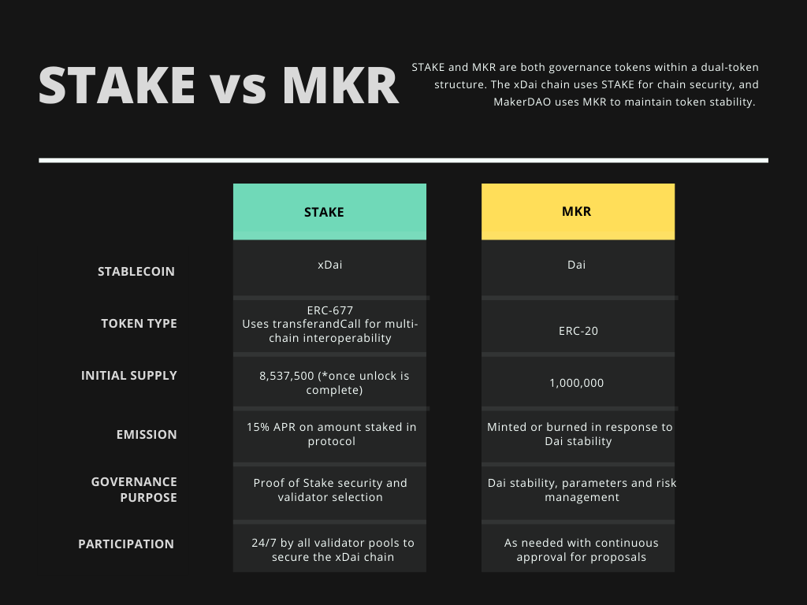

# STAKE vs MKR

MakerDAO and xDai are separate projects that co-exist within the broader blockchain ecosystem. They are distinct protocols, and do not require one another to function \(while xDai is created from Dai, it could leverage a different stable coin to achieve the same result\). However, when used together, they provide complementary structures that promote usability and scalability through stable value transfer. 

* **MakerDAO** is a decentralized organization which creates a stable coin called **Dai** on the Ethereum blockchain. It uses the **MKR token** for governance.
* The **xDai chain** is a distinct blockchain, which uses a converted form of Dai called **xDai** to enable fast, inexpensive and stable transactions.  It uses the **STAKE token** to protect the chain.   

Both systems implement a dual-token structure.  There is a stable token \(Dai / xDai\) designed for stable transactions, and a governance token \(MKR / STAKE\) used to mitigate risks and promote security.  

Here we focus on distinctions between the governance tokens that support the underlying protocol functionality.

## **MKR Tokens**

MKR tokens are used to maintain DAI stability. When DAI remains stable at $1 USD, MKR tokens are burned, reducing the MKR supply and increasing the value of the MKR token over time. However, if DAI moves too far from the $1 mark, MKR tokens are created and sold to raise additional collateral, diluting MKR supply and reducing token value. 

MKR token holders are responsible for regulating DAI value. They have the ability to vote on various parameters \(such as the DAI stability fee and the DAI savings rate\) to balance supply and demand and maintain the DAI peg to the US dollar. The community is incentivized to make decisions that promote DAI stability, resulting in MKR token burning.

MKR Token holders also can vote on other aspects of the protocol, such as adding new types of collateral or making technical improvements, through an on-chain voting process. Investors with more MKR have more voting weight.

Because it is minted 1-for-1 from locked Dai, **xDai inherits the stability features and benefits provided by the MKR governance process.**  The xDai chain then uses the STAKE token to provide an additional Proof-of-Stake security layer for xDai transactions.

## **STAKE Tokens**

STAKE tokens are used to protect the xDai chain. The POSDAO protocol emits STAKE which  provides incentives for honest validators and their delegators and punishes those \(bans and freezes their STAKE amounts\) who do not follow the protocol rules. 

Token holders can commit STAKE into the protocol and receive emission-based STAKE rewards. Individuals who commit a minimum of 20K STAKE are eligible to run a node and become a validator candidate \(a validator is a node that seals blocks and maintains blockchain consensus\).  Delegators can place a minimum of 1K STAKE on validators they believe will best serve the network**\***.


\*Parameters are subject to change prior to [Phase 2 launch](../../for-stakers/stake-and-staking/#phase-2-public-staking-and-reward-expansion).


Delegating STAKE on a validator candidate is akin to placing a vote on that candidate.  The more STAKE \(votes\) a candidate pool receives, the more likely they are to become a validator in the next staking round. Governance \(validator selection\) is provided through on-chain STAKE allocation rather than a defined voting process.

Delegates and validators are rewarded with STAKE emissions for successful block creation and consensus participation. Delegators are incentivized to select the best validators for the job, and validators are incentivized to maintain their nodes, produce correct blocks, and report on the system.

Additional mechanisms serve to regulate and restrict STAKE circulating supply. This includes an Easy Staking protocol that rewards users for locking STAKE in a smart contract for extended periods, and also rewards users who use STAKE to seed Uniswap liquidity pools. 

STAKE is also a multi-chain staking token, meaning it may also be used to protect other blockchain networks in the future, further limiting circulating supply.

## **Additional Details**

| \*\*\*\* | **STAKE** | **MKR** |
| :--- | :--- | :--- |
| Blockchain | xDai \(Initial use case, can be multi-chain\) | Ethereum |
| Current supply | [https://supply.xdaichain.com/](https://supply.xdaichain.com/) | [https://daistats.com/\#/](https://daistats.com/#/) |
| Current price & market cap | [https://coinmarketcap.com/currencies/xdai/](https://coinmarketcap.com/currencies/xdai/) | [https://coinmarketcap.com/currencies/maker/](https://coinmarketcap.com/currencies/maker/) |
| Primary Governance Purpose | Proof-of-Stake security and validator selection | Dai stability, parameters and risk management |
| Governance Process | STAKE delegation to validators as a voting mechanism | On-chain governance and executive voting procedures |
| Collateral usage | May be used as primary collateral in additional protocols. Limited circulating supply increases xDai chain security. | Collateral of last resort to absorb possible losses from Dai creation. Not advisable for use as primary collateral. |

## **References**

1. [https://community-development.makerdao.com/](https://community-development.makerdao.com/)
2. [https://decrypt.co/resources/what-is-maker-mkr](https://decrypt.co/resources/what-is-maker-mkr)
3. [https://community-development.makerdao.com/makerdao-mcd-faqs/faqs/mkr-token\#can-mkr-be-used-as-a-collateral-type](https://community-development.makerdao.com/makerdao-mcd-faqs/faqs/mkr-token#can-mkr-be-used-as-a-collateral-type)

  
****

  

