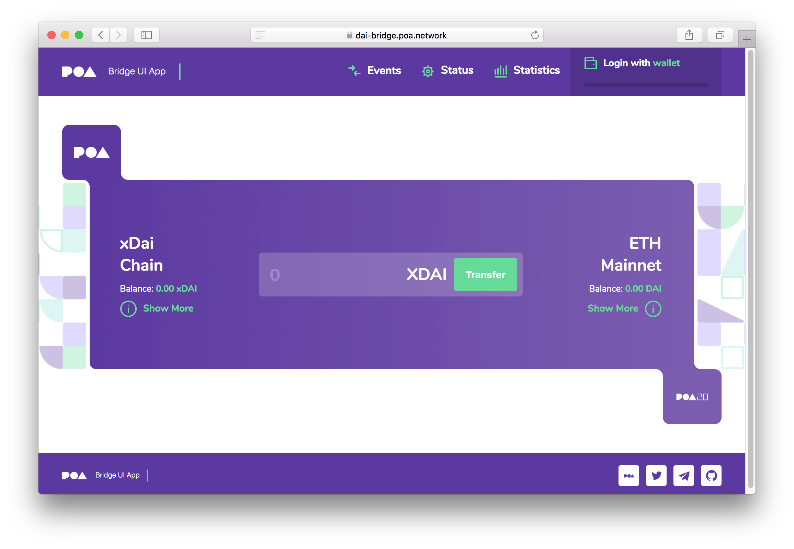
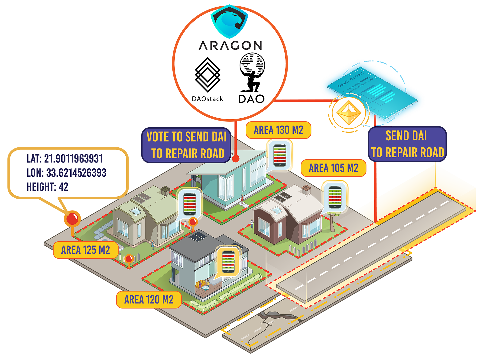

# How xDai Bridges Create Compatibility and Interoperability

The xDai chain is designed for **complete compatible operation** with the Ethereum mainnet and other Ethereum-based chains. It is the only stablechain in production, and is designed to support and enhance the ecosystem as a whole. Users and applications are assured that transaction prices are low and predictable - unaffected by chain usage or market volatility.

Compatibility and interoperability means that applications designed to run on the Ethereum mainnet can also run on xDai. It also means that assets can move freely between the two blockchains. To accomplish this, xDai leverages the [TokenBridge](https://docs.tokenbridge.net/) architecture.

## **xDai Bridge**

The primary function of the xDai Bridge is to facilitate Dai &lt;-&gt; xDai conversion.  TokenBridge has several modes of operation, and the xDai Bridge uses the `ERC20-to-Native` mode to accomplish this task. When a user wants xDai, they can use the [Bridge UI](https://dai-bridge.poa.network/) \(or methods built into other applications\) to convert their Dai into xDai. 

During this operation, the selected amount of Dai is locked in the bridge contract and the corresponding amount of xDai is minted on the xDai chain.  When a user wants to convert xDai back to Dai, the xDai is burned and the Dai is unlocked in the contract and returned to the user’s address on the mainnet. Users can facilitate these transactions using the same address \(tokens are shown based on the chain the user is connected to\) or leverage the [alternate receiver feature ](https://docs.tokenbridge.net/xdai-bridge/using-the-xdai-bridge/alternative-receiver-for-the-xdai-bridge)to transfer tokens cross-chain to a different address.


New bridge functionality will convert the Dai locked in the bridge contract into Chai, which will earn interest for xDai validators. [Read more here](../../for-stakers/stake-reward-mechanics/xdai-rewards/).


## **Arbitrary Message Bridge**

A separate bridge deployed on xDai, called the AMB \(Arbitrary Message Bridge\), allows for a wider range of operations. With the AMB, any assets can be transferred cross-chain. Projects are using this bridge to take advantage of xDai’s stable costs and low fees to complete micro transactions, then bridging back to the Mainnet for storage, trading or liquidity purposes. 

For example, [The Galt Project ](http://galtproject.io/)uses this methodology, highlighting the compatibility and complementary nature of the xDai stable chain. This project tokenizes land and property on the Ethereum Blockchain. To enable governance among property owners, voting tokens are created based on the parameters of these land tokens. Voting tokens are then bridged to the xDai chain to enable DAO-based governance. Because many transactions may be needed to enact a single measure, on-chain governance is accomplished on xDai, while the main land token remains on the mainnet. 

