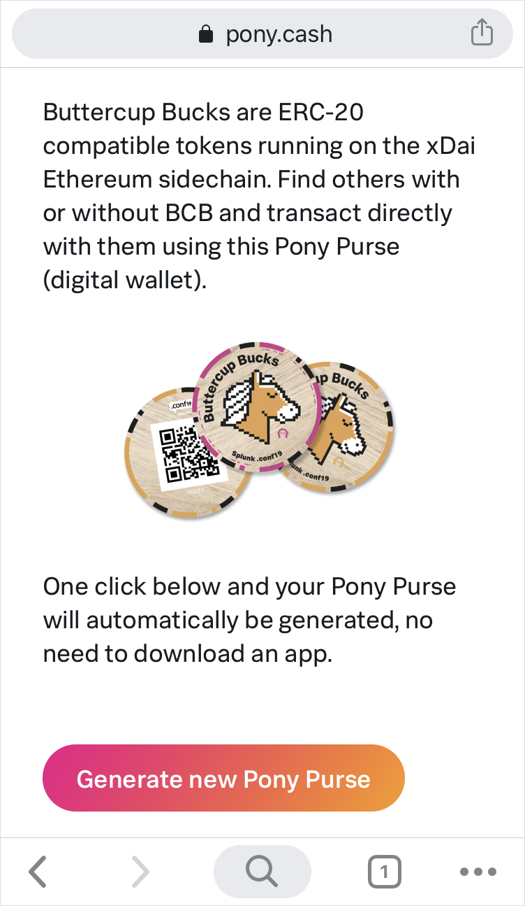
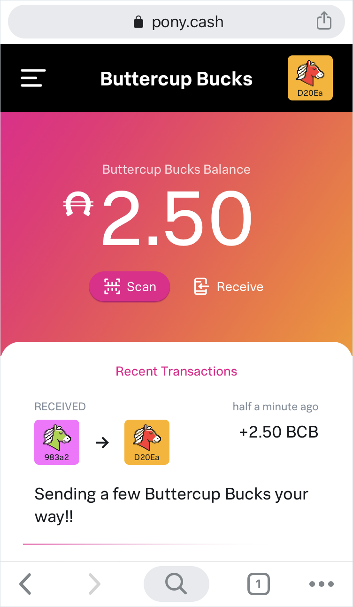
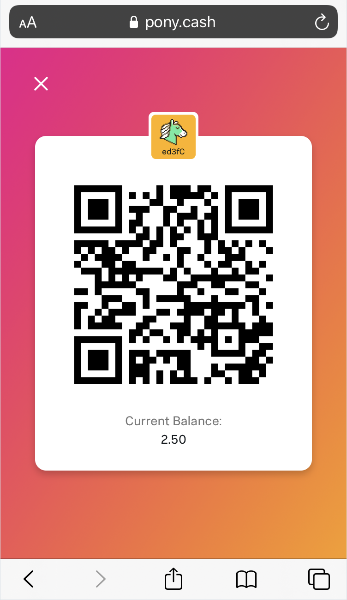
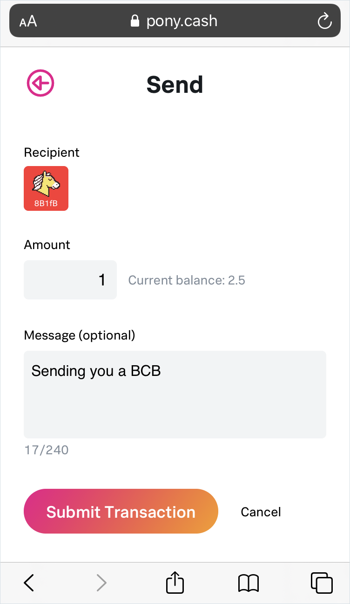

# Pony Purse \(Conference & Event Wallet\)

The Pony Purse is a conference wallet created by the [Splunk](https://www.splunk.com/) Blockchain team. Attendees of the [Splunk conf.19](splunk-conference-non-crypto-conference.md) \(over 10,000 of them!\) used the Pony Purse to purchase items, donate to charity, and interact with games and vendors. The wallet runs on the xDai Chain, leveraging an [Infura endpoint](https://blog.infura.io/infura-brings-scale-to-splunk-xdai-pop-up-cryptocurrency-ab53eda62320) and [Burner Wallet](../../../for-users/wallets/burner-wallet.md) scaffolding and design patterns to create a seamless user experience. 

Here is a quick walkthrough of the Pony Purse, which uses Buttercup Bucks \(BCB - an ERC20 token created on the xDai chain\) as its cryptocurrency for transactions, and is driven by QR code interaction.


At the conference, attendees were onboarded via the conference registration app. This ensured only attendees would get BCB, wallet addresses were known, and key pairs could be recovered easily for each registrant. The example below uses a public url, and keys can be lost easily by logging out of the wallet or using privacy features in your browser!


## Creating a Wallet

1\) Visit  [pony.cash](https://pony.cash) to create a new wallet. You can use a web browser on any device, but the wallet and experience is optimized for mobile. 

2\) A new wallet generates with an initial balance of 0.00 Buttercup Bucks.


If you previously created a wallet, the same wallet should repopulate when you visit pony.cash \(as long as you are not in stealth mode or cleared your local storage\). Keys are kept in local storage,  which allows for easy installation & interaction, but less security.


3\) A Starter QR code containing an amount of ButterCup Bucks is given to each user. To add BCBs, a user scans the code by pressing the scan button, allowing the device to access the camera, and scanning the code. 

The amount of BCB contained in the code is transferred almost instantly to the wallet address. 

4\)  ButterCup Bucks are received. In the example below, BCBs are received via a transfer from one user to another rather than from a BCB Starter token \(sent from address 983a2 -&gt; D20Ea, this is also an acceptable way to fund a wallet\). 

## Sending, Spending and Receiving

Sending and Receiving requires two participants, some BCB to transfer, and a small amount of xDai to pay for transaction costs. Conference users who scan the initial Starter QR code are provided with enough xDai to complete hundreds of transactions.


Since this is an out-of-conference wallet, you may need to transfer a small amount of xDai to your wallet to complete multiple transactions \(gas balance can be viewed in the Advanced screen in the wallet menu\)


1\) The receiver starts by pressing the **Receive** button. This displays the QR code of their wallet.

2\) The sender then clicks the **Scan** button on their wallet, and scans the receiver's QR code. 

3\) Once scanned, information is filled in, including the Amount to send and an optional message to accompany the amount. The sender clicks **Submit Transaction.**

4\) A transaction takes seconds to process.

5\) New Balance and transaction details are reflected in the wallet \(**senders** wallet shown here\).

### Spending


Purchasing items is just as simple. Items for sale are assigned unique QR codes which specify the amount the item costs \(or is open ended if the user determines the cost\) and the address where funds are transferred. The user simply scans the QR code, information populates about the item, and the transaction is submitted, just as in a Peer to Peer transfer. 


### Receiving more BCBs


Participants can complete tasks to earn additional BCBs. Tasks can be listed on the main page of the app during an event. Users receive QR codes for completing tasks and scan to redeem for additional BCBs.


## Additional Features

The Burner Wallet ecosystem is rapidly evolving, and new wallets can include additional plugins, the ability to purchase xDai from fiat, play games, collect NFTs and other features. \(See [Burner Wallet Factory](../../../for-developers/burner-wallet-factory/) for up-and-coming features\) 

For the Splunk conference, Pony Purse did not feature many bells and whistles. Most users were new to cryptocurrency, and the wallet designers kept things simple and intuitive.  

The **Advanced screen** provides details on the smart contracts as well as updated xDai block counts and links to [BlockScout Explorer](https://blockscout.com/poa/xdai/). Information is available for users looking to pull back the curtain and find out more, but not part of the standard user experience.

The **Help and About Screen** is a key component to provide users with needed information and general instructions. 


The Pony Purse was a huge success at conf.19.  It provides a proven, working model for event-based wallets running on the xDai chain.  


### 

