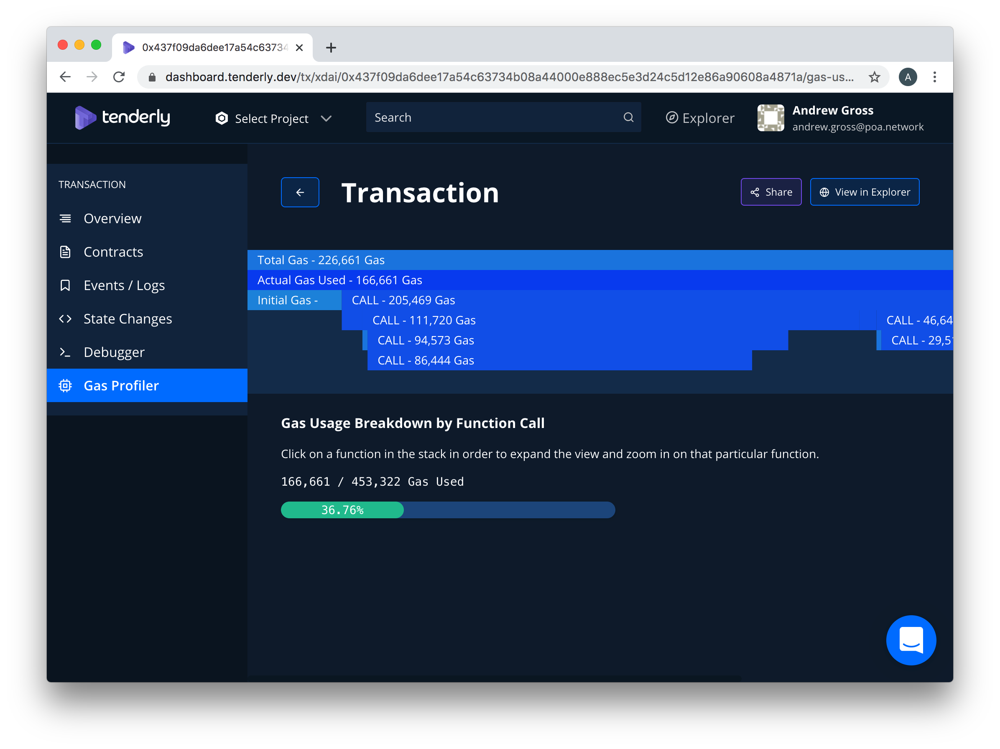

# Developer Resources & Tools

## General Information

| Block Size | Block Speed | Gas price | Patchset | Native token | Network ID |
| :--- | :--- | :--- | :--- | :--- | :--- |
| 10,000,000 Gas | 5 sec | 1 GWei | Istanbul | xDai | 100 |

## Blockchain Explorer

1\) **BlockScout** is the official blockchain explorer for the xDai Chain. With this full-featured, open-source explorer you can view transactions, accounts & balances, access data via the API, and read and verify smart contracts.

👉 [https://blockscout.com/poa/xdai](https://blockscout.com/poa/xdai)

2\) **AnyBlock Analytics Explorer** is convenient for exploring recent transactions and blocks and locating common information quickly**.**

👉 [https://explorer.anyblock.tools/ethereum/poa/xdai/](https://explorer.anyblock.tools/ethereum/poa/xdai/)

## JSON RPC endpoints

There are endpoints provided by POA and Nodesmith. They are used to connect to the network.

### POA RPC

|  |  |
| :--- | :--- |
| URL | [https://dai.poa.network](https://dai.poa.network) |
| Network ID | 100 |

### **Nodesmith RPC**


Nodesmith RPC will be shut down by the end of December 2019.


|  |  |
| :--- | :--- |

<table>
  <thead>
    <tr>
      <th style="text-align:left"><b>URL</b>
      </th>
      <th style="text-align:left">
        
<a href="https://poa.api.nodesmith.io/v1/dai/jsonrpc?apiKey=YOUR_API_KEY">https://poa.api.nodesmith.io/v1/dai/jsonrpc?apiKey=</a>
        

        
(requires <a href="https://nodesmith.io/docs/#/overview/httpsQuickstart">free Nodesmith account for your API key</a>):

      </th>
    </tr>
  </thead>
  <tbody></tbody>
</table>| Network ID | 100 |
| :--- | :--- |

## TokenBridge

A bridge is required to move locked Dai from Ethereum and mint xDai on xDai Chain

You can access the bridge via:

* TokenBridge UI at [https://dai-bridge.poa.network](https://dai-bridge.poa.network)
* Interactions with Smart contracts[https://docs.tokenbridge.net/xdai-bridge/how-to-use-xdai-bridge-without-ui](https://docs.tokenbridge.net/xdai-bridge/how-to-use-xdai-bridge-without-ui)
* Bridge UI built-in into AlphaWallet, BurnerWallet, BurnerFactory

## DApp Management & Developer Tools

* [Terminal ](https://terminal.co)provides management, monitoring and analytics tools for DApp developers. 
* [Pocket](https://www.pokt.network/) provides a decentralized API layer for DApp developers \(IOS, Android & Web SDKs available\) and blockchain users.
* [Tenderly ](https://tenderly.dev/)dashboard supports xDai transaction inspection - smart contracts can also be pushed to the dashboard for real-time monitoring.

## **Additional resources**

Tutorial on how to use GasRelay in your Dapp by Portis. With a few lines of code, gas fees are shifted to DApp owners rather than users, creating an intuitive user experience.  
[https://docs.portis.io/\#/gas-relay](https://docs.portis.io/#/gas-relay)

WebSockets Endpoint \(can be useful to setup BlockScout for xDai\)  
[wss://dai-trace-ws.blockscout.com/ws](wss://dai-trace-ws.blockscout.com/ws)

Archive Fullnode Endpoint \(Useful for setting up BlockScout for xDai\)  
[https://dai-trace-ws.blockscout.com](https://dai-trace-ws.blockscout.com)

Chain [spec](https://github.com/poanetwork/poa-chain-spec/blob/dai/spec.json) files and known [bootnodes](https://github.com/poanetwork/poa-chain-spec/blob/dai/bootnodes.txt) of the xDai network  
[https://github.com/poanetwork/poa-chain-spec/tree/dai](https://github.com/poanetwork/poa-chain-spec/tree/dai)

Netstats, an overview of xDai Chain nodes [http://dai-netstat.poa.network](http://dai-netstat.poa.network/)

DApps Deployed to xDai: Partial list of deployed DApps along with statistics and links: [https://www.stateofthedapps.com/rankings/platform/xdai](https://www.stateofthedapps.com/rankings/platform/xdai)

xDai is available in the Anyblock Index \(aka [http://eth.events](http://eth.events)\), so you can query it via the Elasticsearch API or search in PostgreSQL: [https://account.anyblock.tools/status/](https://account.anyblock.tools/status/)

