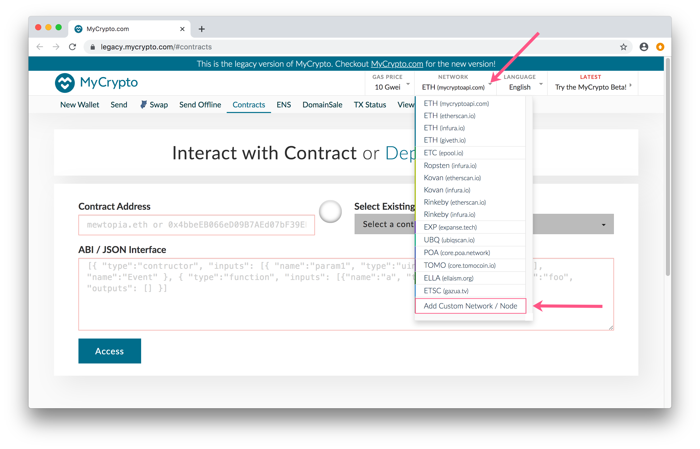
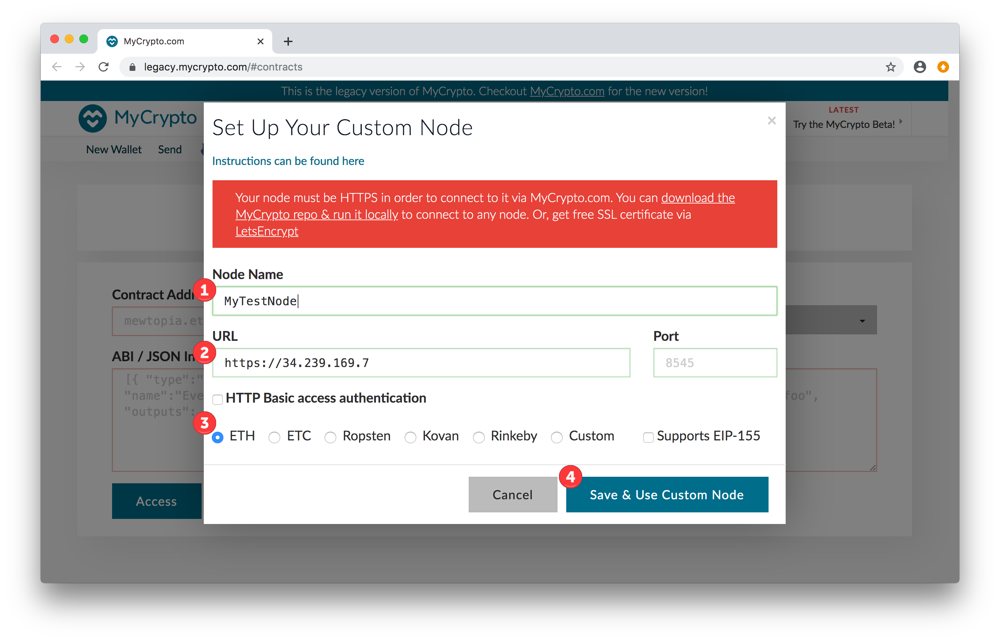

# 5\) Reconfigure Instances


Start here after [initial instance configuration](4-configure-instances.md).



**Note:** Instructions are current for Parity v2.6.2. Updates for v2.6.5+ are in process.


## Master of Ceremonies \(MoC\) Instance Initial Steps

1\) Login to MoC instance and go to the moc directory

```text
ssh -i ubuntu@moc-ec2-user.DNS/Address
```

```text
ubuntu@ip-moc-ec2-user:~ cd ../moc
```

2\) Replace the existing json.spec file, changing parameters as required:

1. Copy: [https://raw.githubusercontent.com/poanetwork/wiki/master/assets/configs/spec.json](https://raw.githubusercontent.com/poanetwork/wiki/master/assets/configs/spec.json).
2. `sudo nano json.spec` paste and make changes as needed:

* `name` must be `{{ network_name }}`
* `engine.authorityRound.params.blockReward` must be `0x0`
* `engine.authorityRound.params.validators.multi.0.list` must contain the `Master of Ceremony` address
* `params.networkID` must be a unique ID for your network. &lt;[See a list of current ids](https://ethereum.stackexchange.com/questions/17051/how-to-select-a-network-id-or-is-there-a-list-of-network-ids)&gt;
* `genesis.gasLimit` - change if needed

3\) Adjust the `node.toml` file on **MoC** with the following settings:  
_\(we use nano in this demonstration, feel free to use vim or another editor of your choice\)_

```text
sudo nano node.toml
```

* `parity.chain` must be a path to spec.json
* `account.unlock` must contain the `Master of Ceremony` address
* `mining.min_gas_price` is a min gas price in Wei
* `mining.engine_signer` must contain the `Master of Ceremony` address
* `mining.gas_floor_target` is a max block size in gas

4\) Launch the `Master of Ceremony` node

```text
sudo systemctl restart poa-parity
```

## Prepare `Register` & `Certifier` Contracts

1\) Clone [https://github.com/parity-contracts/name-registry](https://github.com/parity-contracts/name-registry) repository

```text
git clone https://github.com/parity-contracts/name-registry
cd name-registry
```

* Set `gasPrice` to `0` in `truffle-config.js`. Replace port 7545 with Port 8545.

```text
    diff --git a/truffle-config.js b/truffle-config.js
    index ee5a576..62681ac 100644
    --- a/truffle-config.js
    +++ b/truffle-config.js
    @@ -4,8 +4,9 @@ module.exports = {
       networks: {
         development: {
           host: "127.0.0.1",
    -      port: 7545,
    +      port: 8545,
           network_id: "*",
    +      gasPrice: "0"
         },
       },
     };
```

* Unlock Master of Ceremony in node.toml. 
  * `cd..` to moc directory
  * `sudo nano node.toml`
  * Uncomment \#`unlock=[...]`
  * Restart Parity: `sudo systemctl restart poa-parity`

2\) Deploy Contracts

```text
cd name-registry
sudo npm i
sudo node_modules/.bin/truffle migrate --reset --network development
```


Deployment artifacts will be stored in the `build` subfolder.


3\) Copy these items:

* `spec.json` file - you will replace the Bootnode instance with this file
* Addresses of the newly deployed `Certifier` and `Registry` contracts. Go to the name-registry subdirectory and execute:

```text
grep -Rn \"address\": build/contracts/{SimpleCertifier.json,SimpleRegistry.json} 
```

## Bootnode

1\)  Connect to the Bootnode instance and replace the `spec.json` file at `/home/bootnode/spec.json` with the `spec.json` from the MoC instance.

2\) Restart Parity: `sudo systemctl restart poa-parity`

## Call Contract Methods using MyCrypto

1\) Set a temporary zero fee in the `Registry` contract for registering addresses at the bootnode rpc.

 a\) Check the bootnode ip is accessible in a browser.   
Visit [https://1.2.3.4 ](https://1.2.3.4%20) \(using the bootnode's ip address\). You may see a warning that the certificate is invalid. Click **Advanced** and proceed and unlock the browser. You should now see a message like "**Used HTTP Method is not allowed. POST or OPTIONS is required**". This means the bootnode is ready for the next step.


2\) Go to [https://legacy.mycrypto.com/](https://legacy.mycrypto.com/#contracts) in Google Chrome

3\) Click on the network in the top right and select Add Custom Network/Node



4\) Fill in information about your node. 

1. Node name can be your choice 
2. url is https://1.2.3.4 \(using your bootnode ip\)
3. Keep currency as ETH
4. Save and Use Custom Node


If you are experiencing issues connecting, set your web3 wallet \(metamask\) to the same https://1.2.3.4  bootnode network.




5\) Set gas price to 0. 

* Open context menu \(right click\) for the `Gas Price` slider and choose `Inspect`
* Change the value of `min` attribute of `input` html tag to `0` :
* Close Chrome Developer Tools. Now, you can set zero gas price in the slider


6\) Go to the Contracts Tab. Enter in the **Registry Contract Address** and the **ABI for the Registrar Contract**. 

ABI is located here: [https://raw.githubusercontent.com/parity-contracts/name-registry/master/abis/SimpleRegistry.json](https://raw.githubusercontent.com/parity-contracts/name-registry/master/abis/SimpleRegistry.json)


7\) Select the `setFee` method using the MoC key. Under How to Access, use the json/Keystore file option to connect to your MOC keystore. Set the `_amount` to 0.


8\) Submit the transaction. Fill in the default value for Gas, it may be adjusted \(here the default was 30000 adjusted to 21400.


9\) Repeat the process above  to call the `reserve`  & `setAddress` methods

* `Master of Ceremony` should first call `reserve` method with `_name = 0x6d3815e6a4f3c7fcec92b83d73dda2754a69c601f07723ec5a2274bd6e81e155` \( enter verbatim, this is the keccak hash of  `"service_transaction_checker"`.
* Then call `setAddress` method with:
  * \_name = `0x6d3815e6a4f3c7fcec92b83d73dda2754a69c601f07723ec5a2274bd6e81e155`,
  * \_key = `A` 
  * \_value = `0xCERTIFIER_CONTRACT_ADDRESS`


ABI Resources:

ABI of `Registrar` contract: [https://raw.githubusercontent.com/parity-contracts/name-registry/master/abis/SimpleRegistry.json](https://raw.githubusercontent.com/parity-contracts/name-registry/master/abis/SimpleRegistry.json)

ABI of `Certifier` contract: [https://raw.githubusercontent.com/parity-contracts/name-registry/master/abis/SimpleCertifier.json](https://raw.githubusercontent.com/parity-contracts/name-registry/master/abis/SimpleCertifier.json)


## Update Spec.json file

1\) Update `spec.json` on both **MoC node** and **rpc bootnode.**

* Stop Parity

```text
sudo systemctl stop poa-parity
```

* Add `Registrar` contract address into `params` section of `spec.json.` Make sure it is the appropriate params section.

  ```text
    "name": "...",
    "engine": {
      ...
    },
    "params": {
      ...,
      "NetworkID": "xxx";
      ...,
      "registrar": "0xREGISTRAR_ADDRESS"
    },
    ...
  ```

2\) Restart Parity on both nodes.

```text
sudo systemctl restart poa-parity
```


Next: [Bridge Deployment](bridge-deployment.md)



