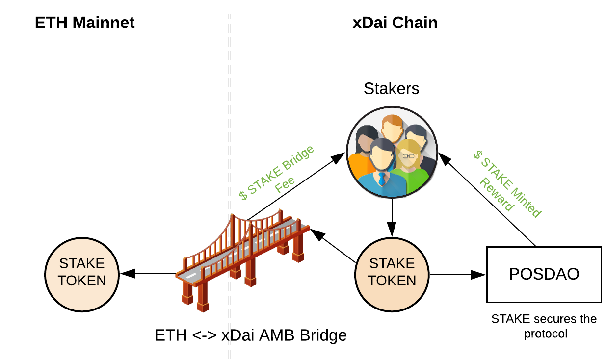

# STAKE Reward Mechanics

When xDai POSDAO protocol \(phase 2\) starts, validator candidates and delegators will place STAKE into the protocol. The amount of STAKE placed determines the corresponding amount of STAKE minted and distributed at the end of a staking epoch. The final emission rate is determined through a risk assessment and community input. The current target is ~15% APR.

STAKE rewards also come from bridge fees assessed when users remove STAKE from the protocol \(move it from the xDai chain to the Ethereum Mainnet\). 

## Additional Rewards

STAKE makes up the largest percentage of the staking incentive. Stakers also receive additional rewards in the form of xDai and EXIT.

* **xDai rewards**.  Paid to stakers from interest accumulated from locked [CHAI](https://chai.money/).  When users convert DAI or SAI into xDAI, it is initially locked as DAI in the bridge. This locked DAI is then converted to CHAI, which earns interest on the converted amount. The interest earned during a staking epoch is distributed to stakers at the end of the epoch. 
* **EXIT rewards**.  EXIT is an exploratory virtual stable currency. It's stable value is backed by soft ETH.  The face value of EXIT is stable, and the market determines the purchasing power of this synthetic reward token. EXIT may be incorporated at the beginning of the protocol or at a later date.

