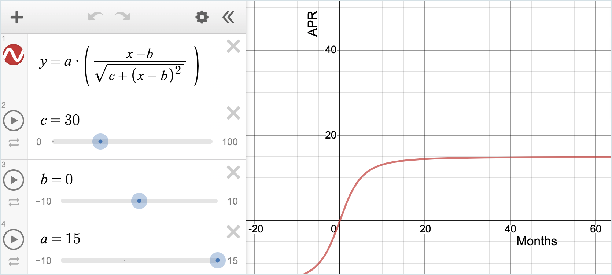

# Easy Staking


This post describes a protocol-in-progress, parameters are being tuned and mechanisms are not yet finalized.  Mechanics and details are subject to change.


## Easy Staking

Easy Staking allows users to place STAKE into a contract and receive STAKE emissions on the Ethereum Mainnet. It is an alternative to staking on the xDai chain - it does not protect consensus but does provide incentives for participants and limits the circulating STAKE supply.

Total STAKE Emissions are minted at 15% APR\*. The amount is divided between Stakers and Liquidity Pool Providers \(see below\). This division is determined by a formula whereby APR rises rapidly after a deposit is made then slows over time.  

APR formula parameters are available here: [https://www.desmos.com/calculator/wvy1eo9qzv](https://www.desmos.com/calculator/wvy1eo9qzv). By clicking on a point on the red curve you can view the month and approximate APR a STAKER will earn.

Stakers and Liquidity Providers each receive a portion of the emission based on how long a Staker decides to keep STAKE in the application. Longer staking times benefit the Staker, and shorter staking periods benefit Dai/STAKE Liquidity Providers. 

\*_Example APR. We are currently testing different emission models_

| Example Staking Time | Staker | Liquidity Providers |
| :--- | :--- | :--- |
| 1 Month | 2.69% APR | 12.31% APR |
| 4 Months | 8.85% APR | 6.15% APR |
| 9 Months | 12.81% APR | 2.19% APR |
| 14 Months | 13.97% APR | 1.03% APR |


As well as functioning as a stand-alone application, Easy Staking may be integrated into hardware wallets or other apps. We are exploring different use-cases.


## Liquidity Pool \(LP\) Participants

Liquidity pool providers will also receive STAKE incentives from the Easy Staking application. Users put funds into a Dai/STAKE liquidity pool on Uniswap will be eligible for these additional incentives.

 Here's an example of how it works for Bob:

1. Bob acquires 70 Dai and 50 STAKE by trading on [Uniswap](https://uniswap.exchange/swap), purchasing on [BitMax](https://bitmax.io/), or through some other means. 
2. He goes to Uniswap \(v2\) and adds both into the STAKE/Dai liquidity pool. 
3. After some time, Bob checks his address and sees that he has received an additional 94.5 STAKE directly to his wallet. He has received STAKE rewards \(at a very high % relative to his pool contribution\) thanks to Mary withdrawing money from Easy Staking.

## STAKE distribution

Mary has 10,000 STAKE she places into the Easy Staking application on the Ethereum Mainnet. She submits a deposit through the Easy Staking UI. After 1 year, she decides to realize her STAKE gains, and submits a withdrawal request.  Since she deposited 10000 STAKE and staked for 1 year,  Mary receives 11365 STAKE \(Her initial amount + 13.65% APR\).  The remaining 135 STAKE \(1.35% APR\) earned as part of the total 15% APR are sent to the LP distribution contract.

Distribution to LP participants occurs through a script which collects addresses and pool amounts. It is called once each day \(within a 24 hour time slots at a random intervals\) and distributes funds based on pool participation percentages.

For simplicity, let's say only Bob and Roger were participating in the LP. Bob has 70 Dai and Roger has 30 Dai in the pool when the distribution script is executed.  At this point, Bob receives 94.5 STAKE \(70% of the STAKE in the distribution contract\) and Roger 40.5 STAKE \(@30%\) based on Mary's withdrawal scenario above.

In this example, this reward APR%  for Bob and Roger is very high, much more than they would have received for other staking methods, as they capture value from all STAKE placed in the Easy Staking contract.  Distribution percentages will vary based on how much Dai is placed in liquidity pools and how much STAKE is placed in the Easy Staking contract. 

## STAKE LP distribution script

Distributions to LP participants occur once within a 24 hour window at a random interval. This prevents any user from entering the liquidity pool at a predetermined time to receive STAKE distributions then exiting shortly thereafter.  

The distribution script will run on a centralized server, and its results can be checked for bias or inaccuracy by any interested party. If the server is compromised, max losses are contained to 1 day of accrued interest from Easy Staking withdrawals. A multi-signature wallet will control Easy Staking parameters, including the address which calls distributions. If issues arise, this address may be changed through the multi-sig process.

Easy staking is non-custodial, no funds are collected and 100% of accumulated rewards are distributed to Easy Staking participants and LP participants.

More liquidity pools with different asset bases may be added in the future, and the distribution mechanics for these pools will be explored further.

## How to Participate

We will provide detailed instructions once the protocol is finalized. 

