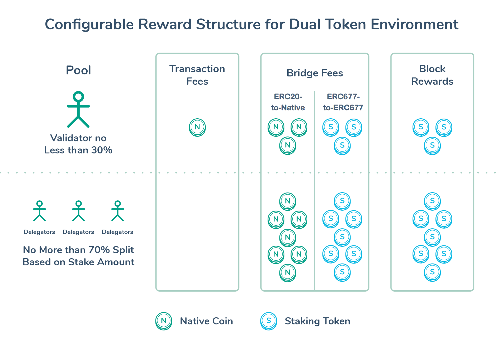

# Rewards in a Dual Token Environment

POSDAO is implemented on xDai with a dual token structure. 

1. **xDai** is the transactional stable coin, used for txs and fees.
2. **STAKE** is the volatile staking coin used to protect consensus.

To participate in POSDAO consensus, validator candidates must provide collateral in the form of STAKE. 20K minimum STAKE is required to create a validator pool. Delegators may place additional STAKE collateral \(1K minimum\) into any pool\(s\) they would like to support. Validator pools with a higher amount of STAKE have a higher probability of selection to the next validator set. 

While the amount of STAKE in a validator pool influences the chances of selection to a validator set, it does not influence the reward amount validator's receive for sealing blocks. Rules are as follows: 

1. Each pool in the validator set receives an equal share of the block reward on block creation.
2. Pool rewards are distributed proportionally, as long as the total delegator’s stake is below 70%.
3. The validator is guaranteed to receive at least 30% of the pool reward. If the total delegator’s stake exceeds 70%, the delegators’ rewards are adjusted accordingly.

In the POSDAO implementation, there are opportunities for additional rewards from multiple sources. Rewards accumulate based on actions that occur during a staking epoch, and are distributed at the end of the epoch to participating validators.

* **Rewards for sealing blocks \(STAKE\)**: STAKE placed in the protocol \(snapshot at the beginning of an epoch\) generates a 15% APR which is distributed to validator pools at the end of a staking epoch.
* **Transaction fees \(xDai\)**: Sent to validator that seals the block containing the transactions.
* **Bridge Fees \(STAKE & xDai\)**: Fees assessed when Dai is bridged to xDai, and when xDai is bridged back to Dai. 
* **Chai interest \(xDai\)**: Dai sent to the xDai bridge contract is locked as Chai, an interest bearing Dai derivative. Interest earned during a staking epoch is converted to xDai and distributed among validator pools.

