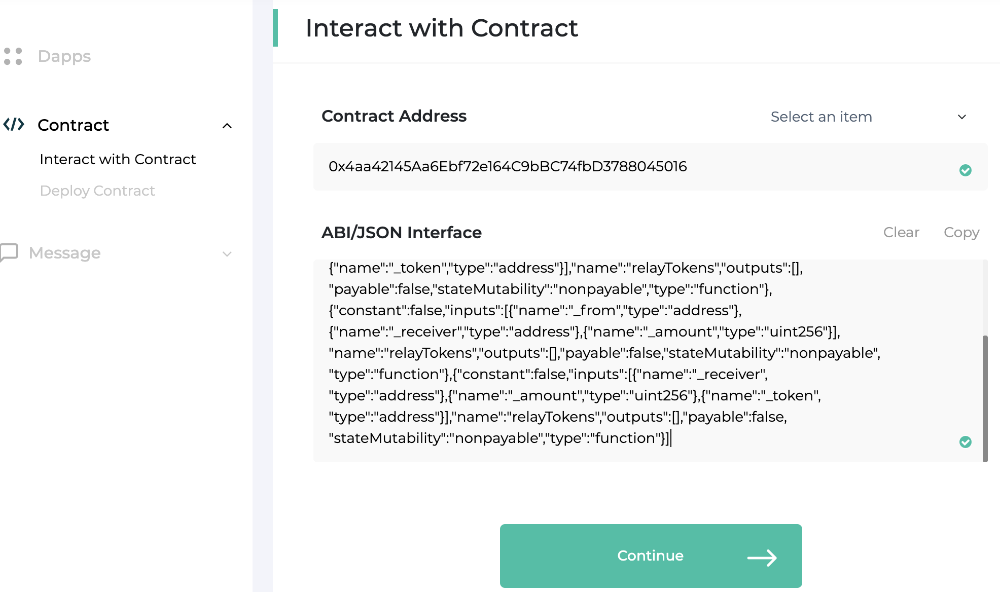
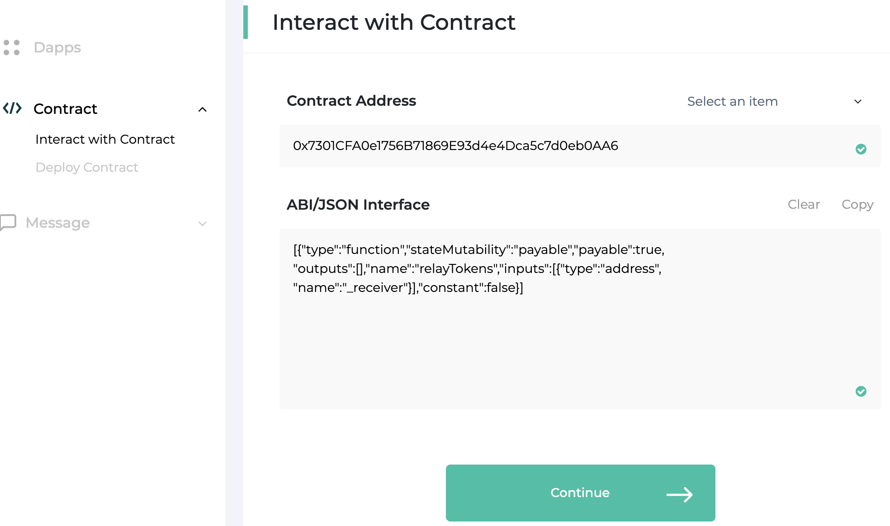
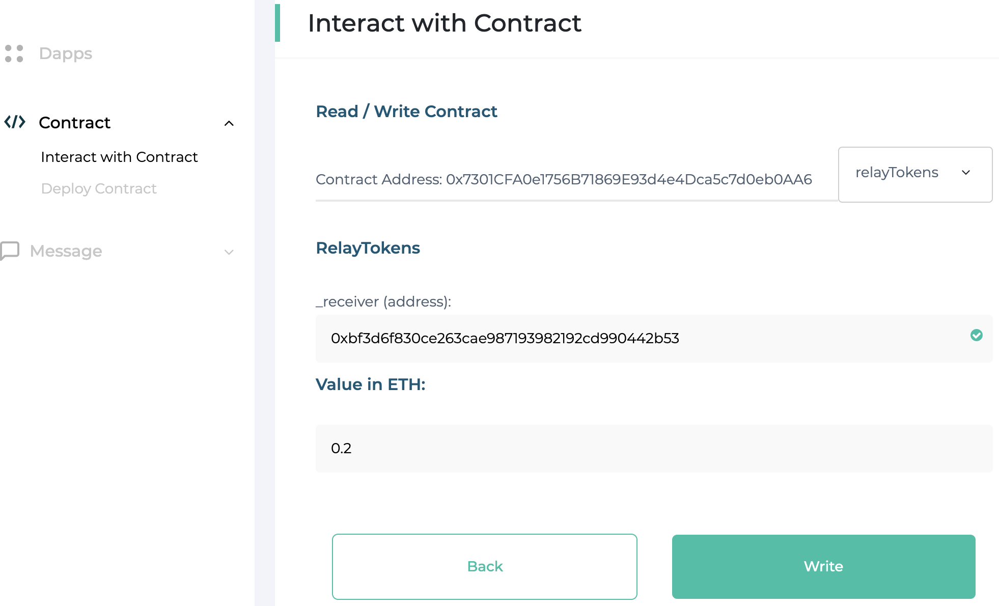

# Alternate Receiver \(Send Dai to another xDai address\)

The xDai bridge now supports an Alternative Receiver option, where users can transfer/transform tokens to a different account in a single transaction. For example, Alice can send Dai to Bob on the xDai chain \(thus transforming Dai into xDai\). Bob can then send xDai to Claire's Ethereum account in a single transaction \(transforming xDai into Dai\).

This feature was developed to support multi-sig wallets and contract calls, however it can also work manually with person-to-person transfer. For illustrative purposes, we will show a method for manual transfer using MyEtherWallet and a web3wallet \(like Nifty Wallet or MetaMask\). The methods differ for each side of the bridge.

### Example: Dai to xDai

1. Choose the Ethereum Mainnet in the Nifty/MetaMask extension and login to [MyEtherWallet \(MEW\)](https://www.myetherwallet.com/access-my-wallet). Ensure you have some Dai to send, as well as some ETH for gas.

2. Go to the **Contracts** -&gt; **Interact with Contract** sidebar menu item. Enter the Dai token contract address to initialize the DAI token contract interface:  `0x6b175474e89094c44da98b954eedeac495271d0f` and the following JSON in the **`ABI/JSON Interface`** field: 

```javascript
[{"constant":false,"inputs":[{"name":"guy","type":"address"},
{"name":"wad","type":"uint256"}],"name":"approve",
"outputs":[{"name":"","type":"bool"}],"payable":false,
"stateMutability":"nonpayable","type":"function"}]
```


3. Approve the bridge contract to perform operations with tokens:


* `Guy` -- `0x4aa42145Aa6Ebf72e164C9bBC74fbD3788045016`the address of the xDai bridge contract in the Ethereum Mainnet
* `Wad` -- the amount of tokens \(in Wei\) that is going to be sent through the bridge. This tool can help with Wei conversion. [https://eth-converter.com/](https://eth-converter.com/)

4. Press **Write** to submit the transaction to the web3wallet. The default gas price may be high, we recommend adjusting to an acceptable value \(we used 5 GWEI\). Wait until the transaction is included in the chain.

5. Press **Back** to interact with a second contract. You will Initialize the xDai bridge contract interface by entering the bridge contract address `0x4aa42145Aa6Ebf72e164C9bBC74fbD3788045016` and the following JSON in the **`ABI/JSON Interface`** field:

```javascript
[{"constant":false,"inputs":[{"name":"_receiver",
"type":"address"},{"name":"_amount","type":"uint256"}],
"name":"relayTokens","outputs":[],"payable":false,
"stateMutability":"nonpayable","type":"function"},
{"constant":false,"inputs":[{"name":"_from","type":"address"},
{"name":"_receiver","type":"address"},{"name":"_amount",
"type":"uint256"},{"name":"_token","type":"address"}],
"name":"relayTokens","outputs":[],"payable":false,
"stateMutability":"nonpayable","type":"function"},
{"constant":false,"inputs":[{"name":"_from","type":"address"},
{"name":"_receiver","type":"address"},{"name":"_amount",
"type":"uint256"}],"name":"relayTokens","outputs":[],
"payable":false,"stateMutability":"nonpayable",
"type":"function"},{"constant":false,
"inputs":[{"name":"_receiver","type":"address"},
{"name":"_amount","type":"uint256"},{"name":"_token",
"type":"address"}],"name":"relayTokens","outputs":[],
"payable":false,"stateMutability":"nonpayable","type":"function"}]
```



6. Press  **Continue**. On the next screen, choose an appropriate `relayTokens` method from the **Select an item** dropdown. There are four methods:


The following options present methods that can be used to transfer SAI -&gt; xDai, as well as specify a second account which can initiate transfers on behalf of a user. Here, we use the first method.


* `relayTokens(address _receiver, uint256 _amount)`-- can be used to specify an alternative receiver to transfer the Dai tokens 
* `relayTokens(address _from, address _receiver, uint256 _amount)` -- intended to be invoked in scenarios when the Dai tokens deposit is performed by another contract on behalf of a user account \(e.g. by a DEX\)
* `relayTokens(address _receiver, uint256 _amount, address _token)` -- can be used to specify an alternative receiver to transfer the Sai tokens
* `relayTokens(address _from, address _receiver, uint256 _amount, address _token)` -- intended to be invoked in scenarios when the Sai tokens deposit is performed by another contract on behalf of a user account \(e.g. by a DEX\)


where

* `_receiver` -- the account that will receive native tokens \(xDai\) on the xDai chain
* `_amount` -- the amount of tokens \(in Wei\) to transfer; it should be less or equal to the amount of tokens approved for the bridge operations

7. Click **Write** to submit the transaction in the web3 wallet \(again check gas price and adjust accordingly\) and wait until it is included in the chain.

8. The xDai bridge will take some time to relay the deposit request to the xDai chain \(8 block confirmations\). After a minute or so,  the xDai balance of the account that was specified as `_receiver` in the `relayTokens` method call will increase. 

### xDai to Dai


Due to some xDai chain / MEW compatibility issues, this method may trigger an error. It does work when initiated in a contract call. We present here for illustrative purposes, as the method is different \(and simpler\) than the Dai -&gt; xDai transfer. 


1. Choose the xDai chain in the browser wallet extension and login to [MyEtherWallet \(MEW\)](https://www.myetherwallet.com/access-my-wallet). Ensure you have some xDai to send.

2. Initialize the xDai bridge contract interface: enter the bridge contract address `0x7301CFA0e1756B71869E93d4e4Dca5c7d0eb0AA6` and the following JSON in the **`ABI/JSON Interface`** field:

```javascript
[{"type":"function","stateMutability":"payable","payable":true,
"outputs":[],"name":"relayTokens","inputs":[{"type":"address",
"name":"_receiver"}],"constant":false}]
```



3. Prepare the call of `relayTokens` method:



* `_receiver` -- the account that will get Dai tokens on the Ethereum Mainnet
* `Value in ETH` -- the amount of native tokens \(in Ether - NOT WEI!\) to transfer

4. Submit the transaction in your web3wallet and wait until it is included in the chain.

5. The xDai bridge will take some time to relay the withdrawal request to the Ethereum Mainnet. Eventually the receiver's Dai account balance will increase. 

