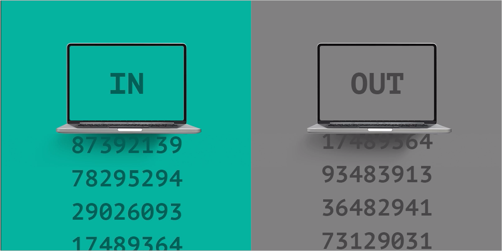
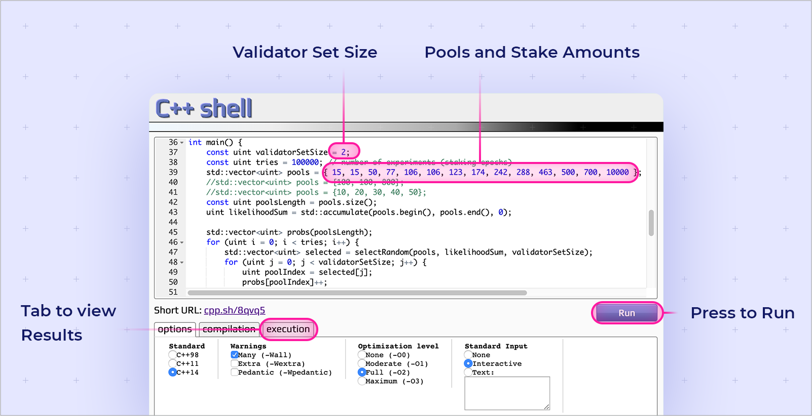

# Reliable randomness


> Q: What do [**computer mouse**](https://www.researchgate.net/publication/222856978_A_true_random_number_generator_based_on_mouse_movement_and_chaotic_cryptography) [**movements**](https://www.researchgate.net/publication/222856978_A_true_random_number_generator_based_on_mouse_movement_and_chaotic_cryptography), [**lava lamp**s](https://blog.cloudflare.com/randomness-101-lavarand-in-production/), [**avalanches**](http://holdenc.altervista.org/avalanche/), and [**radioactive decay**](https://www.fourmilab.ch/hotbits/) have in common?
>
> A: They have all been used as sources of real-world randomness.

True randomness is impossible to achieve using only a computer. Input A always produces Output B, and this deterministic logic is repeatable and predictable. A random number should be unpredictable and independent of previous results, leaving applications to look outside of themselves to seed algorithms with real-world sources of randomness.

Public blockchains, however, are designed to function in a decentralized and trustless fashion, and not rely on outside, centralized factors. While a 3rd party oracle such as [NIST](https://csrc.nist.gov/projects/interoperable-randomness-beacons) can provide random numbers, this can also create a single point of failure and the need to trust a centralized, non-transparent \(and thus manipulatable\) source. It is better to facilitate random number generation on-chain, through decentralized processes.

Randomness is vital to maintaining a fair and autonomous transaction agreement process in a blockchain. While block producers are chosen based on the size of their investment and risk \(for example their total mining rig power, or percentage of stake in the protocol\), an element of chance should also exist. Randomness prevents manipulation, monopolization, and network takeover by a conspiring group of malicious nodes.

In **Proof of Work \(POW\)**, randomness in block producers is built into the protocol. As [Vitalik Buterin states](https://vitalik.ca/files/randomness.html), "_the mining process in a random and unpredictable way "_assigns_" miners the right to create a block whenever they are lucky and discover a hash solution_.” However, POW is resource intensive, and thus many protocols \(including Eth 2.0\) are shifting to a Proof of Stake \(POS\) type of protocol.

In **POS**, there is no intrinsic source of randomness in the block producer \(validator\) selection process, so randomness must be introduced in another way. One way to achieve reliable randomness is by using sources of data provided by the validators themselves.


In this article we discuss:

* Two current approaches to POS randomness.
* How random numbers are created in the [POSDAO ](https://forum.poa.network/t/posdao-white-paper/2208)algorithm, the first Ethereum-based POS algorithm launching soon on the xDai Stable Chain.
* POSDAO weighted validator selection using total stake amounts and randomness, including a working example.
* How DApps can easily access the random seed generated by the protocol.

_Note: Randomness created in a deterministic manner, through computerized means, it is called pseudorandomness. Pseudorandom numbers exhibit the same properties as random numbers. When we refer to randomness in the remainder of this article, we will be talking about pseudorandomness and pseudorandom number generators \(PRNGs\)._

### Two Approaches To Randomness - Numbers in a Glass Hat

There are two major approaches which have been tested and verified to create reliable randomness in POS blockchain systems. Both strategies are sophisticated versions of ‘numbers in a hat’ selection, where participants \(block validators\) provide obscured values that cannot be changed once they are provided. Since the ‘hat’ in this case is completely transparent \(it is on the blockchain for all to see, thus translucent like glass\), the numbers must be cryptographically hidden until they are drawn. When the numbers are revealed, they are combined with other values unknown to the validator to create a new random number.

#### Commit/reveal

This strategy proceeds in 2 phases. In the first phase \(commit\), a random number is generated locally by each validator. This initial number is then concealed using a [hashing function](https://en.wikipedia.org/wiki/Hash_function), and only the hash is committed to the chain. In the second phase \(reveal\), each validator submits their original number, and the submitted number is also hashed. If the hashes match, the original number is confirmed as accurate. Once all numbers are received, they are combined to create a final random number.

This method is efficient and prevents any validator from changing the originally committed number. We use a version of the commit/reveal strategy in the first iteration of POSDAO consensus, described in more detail below.

#### Threshold signatures

Using this approach, validators signal their approval of a block by providing a portion of a signature \(a signature share\) rather than the entire signature. Once a predetermined number of shares are received by the algorithm \(the threshold\), they are combined to create a single signature which cannot be known beforehand. Because this number is secret until it is revealed, it can be used as a random number. A special property of this algorithm is that any combination of validators can collaborate to create the same final signature.

With the threshold signature method, a new random number is created and added to every block, and it can be passed to the application layer. We are currently working on an implementation of threshold signatures which will be incorporated with the HoneyBadger consensus. When the HoneyBadger BFT protocol is complete, POSDAO will allow for two distinct types of pluggable consensus, each utilizing a different PRNG method.

### POSDAO 1.0: Randomness on the xDai Stable Chain

Initially, POSDAO will use a variation of the commit/reveal strategy to create random numbers. It is modelled after [RANDAO](https://github.com/randao/randao), but is executed on-chain by validators in the protocol. Here’s how it works.

1. Random numbers are generated in an ongoing process, during a series of collection rounds. Each round is split into 2 equal phases, a commit phase and a reveals phase. The default length of a collection round is 76 blocks, but this is configurable by chain. On the xDai Stable Chain, a collection round is completed every ~6.3 minutes.
2. During the commit round, each validator produces a 256-bit random number \(possible 2256 different numbers\) locally using their node’s random number generator. 

   `L < 2`256

3. This number is hashed using the [keccak hashing algorithm](https://en.wikipedia.org/wiki/SHA-3), and the resulting 256-bit hash is committed to the chain.

   `keccak256(L) = N. Only N is committed to the chain.`

4. When the reveal round starts, validators reveal their original local random number L, and the algorithm confirms the hash of this number matches the hash previously committed to the chain.

   `keccak256(L) = N`

5. Each time a new number is revealed, it is [XORd](https://en.wikipedia.org/wiki/Exclusive_or) with the previous random seed, creating an entirely new random seed `R` . This process creates an ongoing stream of random seeds and increases entropy during the reveals phase. The last random seed generated in a round is the most secure \(least possibility of validator selection bias\), and DApps should use the final reveal seed in a collection round for maximum security.

   `R2 = R1 XOR secret, R3 = R2 XOR secret, etc.`

6. At the end of the reveals phase, a new collection round starts. The last seed created in the round is used as the first XOR value during the next reveal round. If this is the last reveals round of the staking epoch, the final seed is used for validator selection\*.

_\*The final reveals round of a staking epoch has a special purpose - it is used in the selection process for the next validator set. In a commit/reveal strategy, there is opportunity for validators to bias the selection process \(called the_ [_last actor problem_](https://arxiv.org/abs/1807.09225)_\). Validators can choose to skip revealing their number, thus effectively having 2 choices for the number, either the previous known number if they skip, or the new number if they reveal. If at least one validator is malicious, this can amplify the opportunity for manipulation. For this reason, any skips that occur during the final collection round result in a 90 day ban for that validator, and any rewards collected during the staking epoch are forfeited and distributed to the other validators in the set._

### POSDAO Validator Set Selection



POSDAO differs from many other POS implementations in that a group of validators is chosen to provide consensus for a period of time called a staking epoch. The default staking epoch is 1 week, and during that week, validators in the set take turns proposing and agreeing on blocks to append to the chain. The result is an egalitarian approach to consensus, where all validator pools receive the same block rewards once they are included in the validator set.

Prior to consensus, however, selection to the group of validators is weighted. In other words, candidates with more combined stake in their pools are more likely to be selected as validators. This is in alignment with another component of the algorithm - delegation. A delegator is any individual who holds $DPOS \(the ERC20 staking token for the POSDAO algorithm\) and wants to participate in the consensus process. Delegators can place stake on different candidates as a way to vote on candidates they believe will make the best validators. Candidates who attract more stake from delegators increase their overall odds of selection, and the block reward is shared by members of the pool \(validators and their delegators\). So validator set selection is guided by total pool amount, but it is never guaranteed, thanks to randomness.

The POSDAO validator set weighting algorithm takes into account the total stake amount in a candidate's pool as well as a random number to determine selection to the validator set. The last random number generated in the final collection round is used to seed this algorithm, which cycles through the list of active candidates and adds a new validator to the set with each iteration, until the set is complete \(19 validators for POSDAO\). The link below provides a working example you can test to see different likelihoods for selection.

#### Working Example:





```cpp
#include <iostream>

#include <vector>
#include <math.h>
#include <numeric>
#include <tuple>
#include <algorithm>

std::vector<uint> selectRandom(std::vector<uint> likelihoods, uint likelihoodSum, uint validatorSetSize) {
	const uint poolsLength = likelihoods.size();

	std::vector<uint> validators(validatorSetSize);
	std::vector<bool> used(poolsLength);

	for (uint j = 0; j < validatorSetSize; j++) {
		uint value = rand() % likelihoodSum;

		for (uint poolIndex = 0; poolIndex < poolsLength; poolIndex++) {
			if (used[poolIndex]) {
				continue;
			}

			if (value < likelihoods[poolIndex]) {
				validators[j] = poolIndex;
				likelihoodSum -= likelihoods[poolIndex];
				used[poolIndex] = true;
				break;
			}

			value -= likelihoods[poolIndex];
		}
	}

	return validators;
}

int main() {
	const uint validatorSetSize = 2;
	const uint tries = 10; // number of experiments (staking epochs)
	std::vector<uint> pools = { 15, 15, 50, 77, 106, 106, 123, 174, 242, 288, 463, 500, 700, 10000 }; // pool sizes
	//std::vector<uint> pools = {100, 100, 800};
	//std::vector<uint> pools = {10, 20, 30, 40, 50};
	const uint poolsLength = pools.size();
	uint likelihoodSum = std::accumulate(pools.begin(), pools.end(), 0);

	std::vector<uint> probs(poolsLength);
	for (uint i = 0; i < tries; i++) {
		std::vector<uint> selected = selectRandom(pools, likelihoodSum, validatorSetSize);
		for (uint j = 0; j < validatorSetSize; j++) {
			uint poolIndex = selected[j];
			probs[poolIndex]++;
		}
	}

	std::vector<uint> probsr(poolsLength);
	for (uint i = 0; i < tries; i++) {
		std::vector<uint> selected = selectRandom(std::vector<uint>(pools.rbegin(), pools.rend()), likelihoodSum, validatorSetSize);
		for (uint j = 0; j < validatorSetSize; j++) {
			uint poolIndex = selected[j];
			probsr[poolIndex]++;
		}
	}

	std::cout << std::endl;
	std::cout << "[ W/sumW ]   [ AlgoAsc ] [ AlgoDesc ]" << std::endl;
	for (uint poolIndex = 0; poolIndex < poolsLength; poolIndex++) {
		std::cout << std::fixed
			<< " " << pools[poolIndex] * 1.0 / likelihoodSum
			<< "  |  " << probs[poolIndex] * 1.0 / tries
			<< "    " << probsr[poolsLength - 1 - poolIndex] * 1.0 / tries
			<< std::endl;
	}

	return 0;
}
```



By default, this algorithm uses a validator set of 2, with 14 possible candidates. Each candidate pool contains varying amounts of stake \(15, 15, 50, 77, 106, 106, 123, 174, 242, 288, 463, 500, 700, 10000\). When you run the program, the probability of selection to the validator set is shown in the execution tab.

The following fields can be modified to influence selection odds for each pool:

**Line 37:** Required number of validators: `const uint validatorSetSize = 2`

Increase the number 2 to increase the validator set size, impacting probabilities for selection to the overall set

**Line 39:** The stake amounts in each pool: `std::vector<uint> pools = { 15, 15, 50, 77, 106, 106, 123, 174, 242, 288, 463, 500, 700, 10000 }; // pool sizes`

Changing these values changes the selection probability. You can also add more validator pools to the set to test different options.

#### Execution Output:


The first column \(W/sumW\) shows a standardized probability distribution with 1 acting validator. The second \(AlgoAsc\) shows the probability output from our weighted algorithm \(default is 2 validators, for comparison to W/sumW set `const uint validatorSetSize = 1)`. The third column shows the results in descending pool order, to ensure the output is not influenced by order.

In this default example, the candidate pool with 10000 stake has a ~95% chance of selection to the validator set of 2, and the candidate with 700 has ~25% chance of selection. The numbers can be adjusted to view different probabilities based on the stake amount, the number of candidates, and the number of validators in a set.

### Other uses for POSDAO on-chain randomness

Many blockchain applications need a source of randomness to function properly. The classic example is a lottery or other gambling application. Applications running on the POSDAO enabled xDai Stable chain can easily access the random number created through the protocol, and use it to seed their own randomness generators. _Note: this method may be biased if a validator skips revealing a number, due to the last actor problem mentioned above. For this reason, caution should be used if implementing for large payout games._

During the reveals round, a new seed is created whenever a validator reveals their random number \(it is XORd with the previous seed to create new random seed `R`\). The `R` value is then stored in an easy-to-access function called `currentSeed`. `currentSeed` can be called from an application, and once the seed is retrieved, it can be used to create a new random number with a simple hashing function like `random = keccak256(_seed)`. Further entropy can be achieved using the additional random values generated by the protocol, for example with `random = keccak256(random, _seed)`.

A simple smart contract example which calls the `currentSeed` getter is available below, under the **currentSeed bullet item**:

[https://github.com/poanetwork/posdao-contracts\#Smart-Contract-Summaries](https://github.com/poanetwork/posdao-contracts#Smart-Contract-Summaries)

### Conclusion

Randomness is vital to a blockchain, and difficult to achieve within the protocol. Version 1.0 of the POSDAO algorithm will use a commit/reveal strategy to achieve reliable randomness for validator selection. Smart contract developers can also access this number as a dynamic seed for their own random number generators. In version 2.0 of the POSDAO protocol, the Honey Badger BFT algorithm will include a threshold signature strategy to create reliable per-block randomness.

POSDAO on the xDai Stable Chain will offer the first Ethereum implementation of Proof of Stake, and on-chain randomness is a key feature of this implementation.


The article is copied from [https://forum.poa.network/t/reliable-randomness-bringing-on-chain-entropy-to-the-xdai-stable-chain/3015](https://forum.poa.network/t/reliable-randomness-bringing-on-chain-entropy-to-the-xdai-stable-chain/3015)


